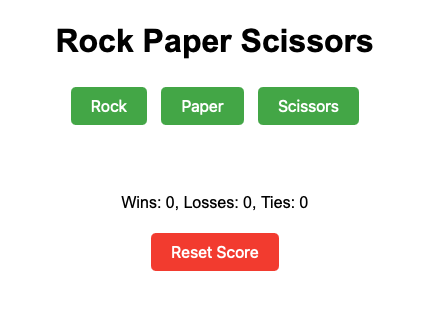

# Rock-Paper-Scissors Game

A simple yet engaging implementation of the classic Rock-Paper-Scissors game with a smart AI opponent. Built with vanilla JavaScript, HTML, and CSS.

## Features

- Classic Rock-Paper-Scissors gameplay
- Smart AI that learns from your moves
- Persistent score tracking using localStorage
- Clean, responsive interface
- Mobile-friendly design

## How to Play

1. Open `2-08-rock-paper-scissors.html` in any modern web browser
2. Click on (Rock), (Paper), or (Scissors) to make your move
3. The AI will make its move and the result will be displayed
4. Your score is automatically saved between sessions
5. Use the "Reset Score" button to start fresh

## AI Behavior

The AI uses a simple strategy to make the game more challenging:
- Tracks your most frequently used movesß
- 70% chance to counter your most common move
- 30% chance to make a random move

## Technologies Used

- HTML5
- CSS3
- JavaScript (ES6+)
- localStorage for data persistence

## Browser Support

All modern browsers including:
- Chrome (latest)
- Firefox (latest)
- Safari (latest)
- Edge (latest)

## License

This project is open source and available under the [Apache License 2.0](LICENSE).

---